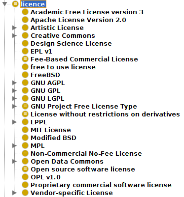
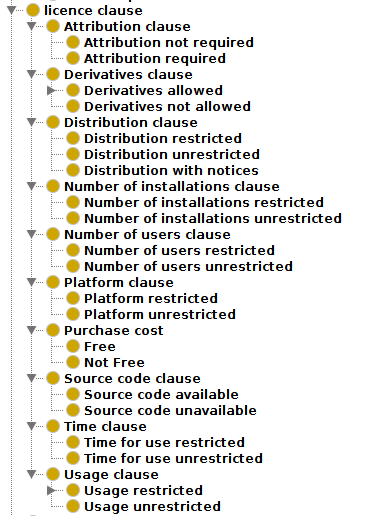
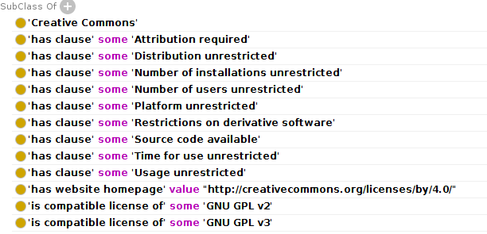
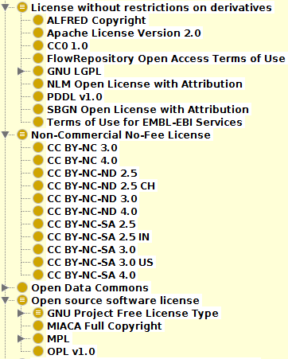

# Modelling Licences in SWO

Within SWO, software can be related to the licences that describe how that they may be used. The licences themselves are also modelled so that they can be described along two main axes:

1. **Their owning organization.** Licences are grouped according to the organization that developed them, e.g Creative Commons or GNU.
2. **Their stated requirements.** Licences are also grouped according to the constraints described within them. Attribution, cost and distribution are just a few examples of the clauses described within SWO.

The hierarchy provided by SWO together with the rich modelling of what each license allows and does not allow makes it a useful tool for any resource that wishes to provide searches or curation based on licence type. Databases can provide users with a list of all "Non-commercial no-fee" licenses; all Creative Commons licences; those that comply with the GNU project free licence type; and more. Any licence or clause/constraint that is not yet in SWO can be easily added. We invite members of the community to contact us via our [Issue Tracker](https://github.com/allysonlister/swo/issues) if they would like additional clauses, licences or groupings added.

Please see the next section for further detail of the ontology and its axiomization with regards to licences.

# Licence Hierarchy: Greater Depth

The asserted hierarchy is relatively flat, with a simple list of licenses grouped by their owning organizations.

In this way, the asserted hierarchy remains a simple, easy-to-read structure. Added semantics are provided by a set of axioms that describe each licence in detail. These axioms relate each license to a hierarchy of licence clauses.

For example, the CC BY 4.0 licence contains the following axioms:

In addition to the licence classes and licence clause classes, we have created a number of defined classes which will group licenses according their clauses upon inference with a reasoner. This allows multiple inferred hierarchies that group licences according to any number of axes such as open source licences, fee-based licences, and more. Additional defined classes to suit users can be added as required.

Not all licences are included in SWO, but we invite members of the community to contact us via our [Issue Tracker](https://github.com/allysonlister/swo/issues) if they would like additional clauses, licences or groupings added.
